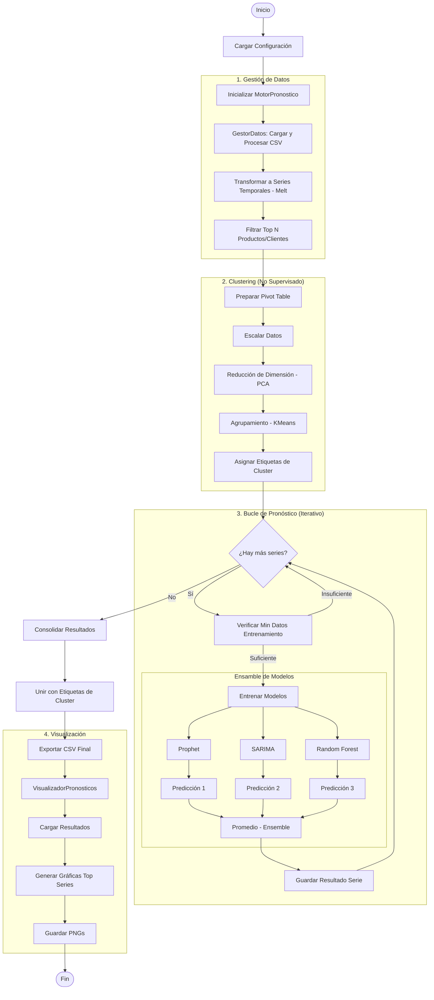
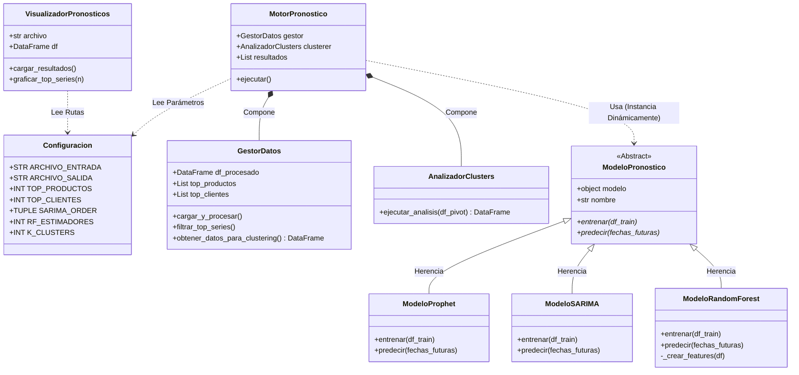

# Sistema de Pronóstico de Demanda (Ensemble & Clustering)

Este proyecto implementa un sistema robusto de pronóstico de demanda utilizando técnicas avanzadas de Machine Learning y Series Temporales. El sistema está diseñado bajo el paradigma de Programación Orientada a Objetos (POO) para garantizar modularidad y escalabilidad.

## 🚀 Características Principales

El sistema utiliza un enfoque de **Ensamble (Promedio de Modelos)** para mejorar la precisión de las predicciones, combinado con una segmentación previa de series.

1.  **Ingeniería de Datos**: Carga, limpieza y transformación (Melt) de datos históricos.
2.  **Clustering (Segmentación)**:
    * Reducción de dimensionalidad con **PCA**.
    * Agrupamiento de series similares (Producto-Cliente) mediante **K-Means**.
3.  **Modelos de Pronóstico (Ensemble)**:
    * **Prophet**: Para capturar tendencias y estacionalidades complejas.
    * **SARIMA**: Para patrones estacionales y autocorrelación estadística.
    * **Random Forest**: Para capturar relaciones no lineales.
4.  **Visualización**: Generación automática de gráficas para las series más relevantes.

## 📋 Requisitos Previos

* Python 3.8+
* Se recomienda usar un entorno virtual.

## 🛠️ Instalación

1.  Clona el repositorio:
    ```bash
    git clone [https://github.com/TU_USUARIO/forecast-ensemble-system.git](https://github.com/TU_USUARIO/forecast-ensemble-system.git)
    cd forecast-ensemble-system
    ```

2.  Instala las dependencias:
    ```bash
    pip install -r requirements.txt
    ```
## 📊 Diagrama de Flujo
El sistema sigue un flujo lineal estructurado en 4 etapas principales, coordinadas por un orquestador central.


## 🧩 Diagrama de Clases UML


## 📂 Estructura de Datos de Entrada

El script espera un archivo CSV en la raíz (o configurado en la clase `Configuracion`) con el nombre:
`Datos Históricos de Pedidos y de Facturación.csv`

El formato esperado debe contener columnas descriptivas (Producto, Cliente) y columnas de fechas en formato ancho (e.g., `23-Jan`, `23-Feb`...) que el sistema transformará automáticamente.

## ▶️ Ejecución

Para ejecutar el pipeline completo (Carga -> Clustering -> Pronóstico -> Exportación):

```bash
python src/main.py
```
## 📂 Estructura del Repositorio
```Plaintext
forecast-ensemble-system/
│
├── data/
│   ├── inputs/     # Datos crudos
│   ├── outputs/    # CSV y gráficas generadas
│   └── docs/       # diagrama de flujo y diagrama UML
│
├── src/
│   ├── __init__.py
│   └── main.py     # Codigo de pronostico de demanda poo
│
├── .gitignore      # Archivo para excluir archivos temporales y datos
├── LICENSE         # Licencia de uso (MIT recomendada)
├── README.md       # Documentación del proyecto
└── requirements.txt # Lista de librerías necesarias
